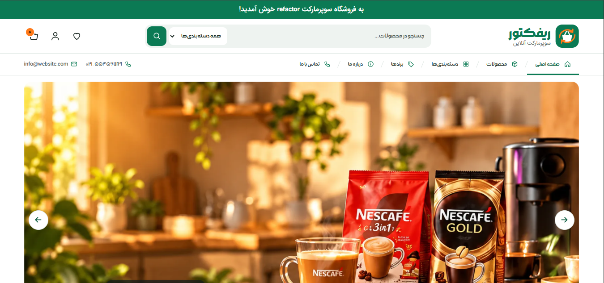
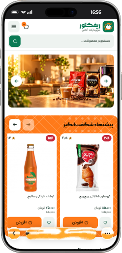

# 🛒 Refactor — صفحه فروشگاه

## ۱) اسکرین‌شات‌ها





---

## ۲) انیمیشن‌ها

توی صفحه چندتا انیمیشن داریم. این جدوله که نشون می‌ده هر انیمیشن چیکار می‌کنه:

| انیمیشن | چی عوض می‌شه | چطور اجرا می‌شه |
|---|---|---|
| بنر بالای صفحه | شفافیت | Composite |
| بالا اومدن کارت وقتی روش موس می‌ره | جابه‌جایی ۴ پیکسل به بالا | Composite |
| سایهٔ کارت | شفافیت | Composite |
| منوی موبایل | شفافیت و جابه‌جایی | Composite |
| حرکت کاروسل | اسکرول خود مرورگر | بدون محاسبهٔ مجدد |
| دکمه‌ها وقتی روش موس می‌ره | رنگ پس‌زمینه و متن | Paint |

انیمیشن‌هایی که با `transform` و `opacity` درست کردم، چون این دوتا خیلی سبک‌ان و مرورگر راحت اجراشون می‌کنه. عمداً از تغییر چیزهایی مثل `width`، `height` و موقعیت عناصر که باعث می‌شن مرورگر کل صفحه رو دوباره حساب کنه، خودداری کردم.

### سایهٔ کارت

سایهٔ کارت رو مستقیم با `box-shadow` انیمیت نکردم؛ به جاش از `opacity` روی یه pseudo-element استفاده کردم (چون `box-shadow` سنگینه).

### کاهش حرکت

اگه کاربر تنظیمات سیستمش رو روی حرکت کمتر (`prefers-reduced-motion`) گذاشته باشه، انیمیشن‌ها کمتر یا کلاً خاموش می‌شن تا راحت‌تر باشه.

---

## ۳) بنر بالای صفحه

توی بنر بالای صفحه، نمایش و مخفی شدن کنترل‌ها با `visibility` و شفافیت انجام می‌شه. تغییر `visibility` کل صفحه رو دوباره حساب نمی‌کنه، ولی ممکنه یه (Paint) کوچیک داشته باشه.

## ۴) منوی موبایل

منوی موبایل بدون JavaScript و فقط با این دوتا کار می‌کنه:

- `<input type="checkbox">`
- `<label>`

یعنی یه چک‌باکس مخفی داریم و با کلیک روی label، منو باز و بسته می‌شه.

وقتی منو بسته‌ست، این ویژگی‌ها رو داره:

```css
opacity: 0;
visibility: hidden;
transform: translateY(-8px);
```

`visibility: hidden` باعث می‌شه منوی مخفی نه با موس بشه باهاش کار کرد و نه با کیبورد فوکوس بگیره.

### زیرمنوی دسکتاپ

زیرمنوی دسکتاپ هم علاوه بر اینکه با موس باز می‌شه (`:hover`)، با کیبورد هم باز می‌شه (`:focus-within`) تا کاربرای کیبورد هم بتونن ازش استفاده کنن.

## ۵) URL Fragment (اون # توی آدرس)

اون قسمتی که بعد از `#` توی URL میاد، به سرور فرستاده نمی‌شه و مرورگر خودش مدیریتش می‌کنه.

مثلاً:

```
#dairy
```

باعث می‌شه مرورگر توی همون صفحه بره سراغ عنصری که `id="dairy"` داره. یعنی صفحهٔ جدیدی لود نمی‌شه، فقط می‌ره پایین‌تر.

با `:target` هم می‌شه اون بخش مقصد رو موقع ورود مشخص کرد (مثلاً رنگش رو عوض کرد).

مثلاً:

```css
#dairy:target {
  /* styles */
}
```

## ۶) کاروسل بدون JavaScript

**حرکت:** کاروسل با قابلیت‌های خود مرورگر ساخته شده.

این ویژگی:

```css
overflow-x: auto;
```

امکان اسکرول افقی رو می‌ده، و:

```css
scroll-snap-type: x mandatory;
```

باعث می‌شه موقعیت اسکرول روی نقاط مشخص‌شدهٔ کارت‌ها بشینه.

**دکمه‌ها:** دکمه‌های کاروسل با قابلیت‌های pseudo-elementها ساخته شدن:

```css
::scroll-button(inline-start)
::scroll-button(inline-end)
```

بنابراین برای کنترل حرکت کاروسل نیازی به JavaScript نیست.

## ۷) دسترس‌پذیری (Accessibility)

برای اینکه همه بتونن از صفحه استفاده کنن (حتی کسایی که مشکل بینایی یا حرکتی دارن) این کارا انجام شده:

- یه لینک "پرش به محتوای اصلی" گذاشتم که موقع استفاده از کیبورد دیده می‌شه.
- یه `h1` اصلی داریم و ترتیب Headingها (`h2`، `h3`، `h4`) رعایت شده.
- برای تصاویر معنادار، `alt` مناسب گذاشتم.
- برای کنترل‌ها و عناصر تعاملی، `aria-label` گذاشتم.
- اندازهٔ دکمه‌ها و لینک‌ها مناسب هست که با انگشت هم راحت بشه زد.
- رنگ متن و پس‌زمینه کنتراست کافی دارن.
- از `prefers-reduced-motion` پشتیبانی می‌کنه.
- منوی دسکتاپ با کیبورد هم باز می‌شه (`:focus-within`).

## ۸) لوگو

اجزای اصلی لوگو اینان:

- یه مستطیل سبز با گوشه‌های گرد (پس‌زمینهٔ آیکون)
- یه شکل سفید برای بدنهٔ سبد
- یه شکل سفید برای دستهٔ سبد
- چهارتا فلش نارنجی چرخشی (نشون‌دهندهٔ مفهوم Refactor)
- دوتا متن برای اسم و شعار

**چرا SVG؟**

چون SVG برداریه، هرچی بزرگش کنی کیفیتش خراب نمی‌شه. همچنین می‌شه رنگ و شکل اجزاش رو با HTML و CSS عوض کرد.